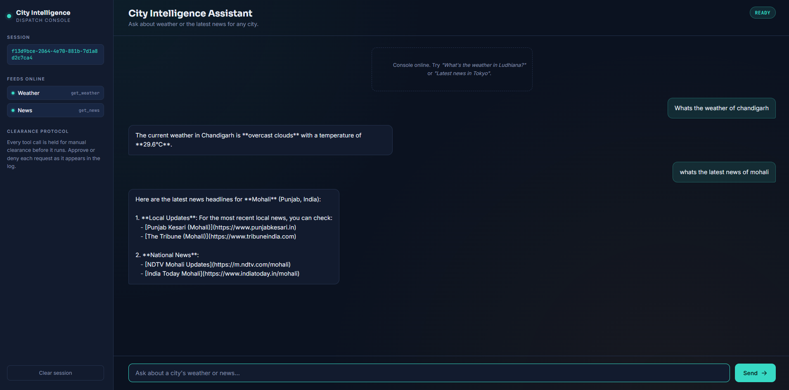

<div align="center">

# 🌍 City Intelligence Console

**An agentic AI assistant that reasons about real-world tools — and asks before it uses them.**

[](https://www.python.org/)
[](https://flask.palletsprojects.com/)
[](https://www.langchain.com/)
[](https://mistral.ai/)
[](#license)

<br>

[](https://city-agent-uhok.onrender.com)
[](https://github.com/rajputshivamsingh510/city-agent)

</div>

---

## 📸 Preview

<p align="center">
  
</p>

---

## 📖 Overview

**City Intelligence Console** is a real-time, tool-using AI agent that answers questions about any city — current weather, live news, and general conversation — while keeping a human in the loop for every external action it takes.

Most chatbot demos either call APIs blindly or fake "agentic" behavior with hardcoded logic. This project is different: it uses a **LangChain agent backed by Mistral** to *reason* about whether a tool call is needed, then pauses and asks for explicit user approval before executing it. Nothing touches an external API without a person saying yes.

It's built to demonstrate three things employers actually care about in an agentic AI hire:

- **Tool-use reasoning** — the LLM decides *when* a tool is necessary, not just how to call it.
- **Human-in-the-loop control** — a thread-safe approval middleware sits between decision and execution.
- **Production packaging** — a real Flask backend, session-based state, and a live Render deployment, not just a notebook.

---

## ✨ Key Features

| Category | Capability |
|---|---|
| 🤖 Agent | LangChain agent with tool-calling powered by Mistral LLM |
| 🛠 Tools | Real-time weather (OpenWeather API), live news search (Tavily API) |
| 👨‍💻 Safety | Human-in-the-loop approval before any tool executes |
| 🧵 Reliability | Thread-safe approval middleware for concurrent sessions |
| 💾 State | Session-based conversation history with reset support |
| 🎨 UI | Clean, responsive chat interface (HTML/CSS/JS) |
| ☁️ Deployment | Production-ready, deployed on Render with Gunicorn |

---

## 🏗 Architecture

```
                    User Query
                        │
                        ▼
              Flask Web Server (app.py)
                        │
                        ▼
              LangChain Agent (Mistral)
                        │
         ┌──────────────┴──────────────┐
         │                             │
         ▼                             ▼
   Weather Tool                    News Tool
 (OpenWeather API)              (Tavily Search)
         │                             │
         └──────────────┬──────────────┘
                        ▼
          Human Approval Middleware
             (Approve ✅ / Deny ❌)
                        │
                        ▼
              Final AI Response
```

**How it works:**

1. A user asks something like *"What's the weather in Delhi?"*
2. The agent reasons that this requires an external tool and stages the call.
3. The approval middleware intercepts execution and surfaces an **Approve / Deny** prompt to the user.
4. **If approved** → the tool runs → results are passed back to the LLM → a grounded response is generated.
5. **If denied** → the LLM responds conversationally, without any external call.

---

## 🛠 Tech Stack

**Backend:** Python · Flask · LangChain · LangChain Agents & Tools · LangChain Middleware · Mistral AI
**APIs:** OpenWeather API · Tavily Search API
**Frontend:** HTML5 · CSS3 · JavaScript
**Deployment:** Render · Gunicorn

---

## 📂 Project Structure

```
city-agent/
├── app.py                  # Flask app + agent orchestration
├── requirements.txt        # Python dependencies
├── .env                    # API keys (not committed)
├── templates/
│   └── index.html          # Chat UI
├── static/
│   ├── style.css
│   └── script.js
└── images/
    └── city-console.png
```

---

## 🌐 API Reference

| Method | Endpoint | Description |
|---|---|---|
| `GET` | `/` | Serves the web chat interface |
| `POST` | `/api/chat` | Sends a user message to the agent |
| `GET` | `/api/pending` | Retrieves a pending tool-approval request |
| `POST` | `/api/approve` | Approves or denies a pending tool call |
| `POST` | `/api/reset` | Clears the current session's conversation history |

---

## ⚙️ Getting Started

### Prerequisites
- Python 3.11+
- API keys for Mistral, OpenWeather, and Tavily

### Installation

```bash
# Clone the repository
git clone https://github.com/rajputshivamsingh510/city-agent.git
cd city-agent

# Create and activate a virtual environment
python -m venv venv
source venv/bin/activate      # Windows: venv\Scripts\activate

# Install dependencies
pip install -r requirements.txt
```

### Configuration

Create a `.env` file in the project root:

```env
MISTRAL_API_KEY=your_key_here
OPENWEATHER_API_KEY=your_key_here
TAVILY_API_KEY=your_key_here
```

### Run locally

```bash
python app.py
```

Then open **http://localhost:5000** in your browser.

### Deploy

Deployed on **Render** with the following configuration:

```bash
# Build Command
pip install -r requirements.txt

# Start Command
gunicorn app:app
```

---

## 🔮 Roadmap

- [ ] Voice-based interaction
- [ ] Additional tools: air quality, currency conversion, hotel/restaurant search
- [ ] Interactive maps integration
- [ ] Persistent chat history via database
- [ ] User authentication
- [ ] Docker support + CI/CD pipeline

---

## 📄 License

Distributed under the **MIT License**. See `LICENSE` for details.

---

<div align="center">

## 👨‍💻 Author

**Shivam Singh**

[](https://github.com/rajputshivamsingh510)
[](https://www.linkedin.com/in/shivam-singh-243000232/)

If this project was useful to you, consider giving it a **⭐ on GitHub** — it helps a lot.

</div>
